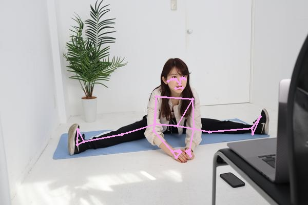

# Arcade Dancing System

[](https://github.com/akari-doichan/Arcade-Dancing-System)

[](https://github.com/akari-doichan/Arcade-Dancing-System/blob/main/LICENSE)
[](https://akari-doichan.github.io/Arcade-Dancing-System/)

A Novel Arcade dancing System.

## Installation

I recommend you to use these tools to avoid the chaos of the python environment. See other sites for how to install these tools.

- [Pyenv](https://github.com/pyenv/pyenv) is a python installation manager.
- [Poetry](https://python-poetry.org/) is a packaging and dependency manager.

```sh
$ pyenv install 3.8.9
$ pyenv local 3.8.9
$ python -V
Python 3.8.9
$ poetry install 
```

## Pose Detection

|Input|[MediaPipe](https://google.github.io/mediapipe/solutions/pose)|
|:-:|:-:|
|||

### Command Line

You can easily do some process by executing the following command.

#### Covert from Video to Landmarks

```sh
$ poetry run video2landmarks --video data/sample-instructor.mp4
```

## Generate Documentations

```sh
# Format Python code in "ddrev" directory.
$ ./docs-format.sh
# Use "sphinx" to generate a documentation.
$ ./docs-generate.sh
```